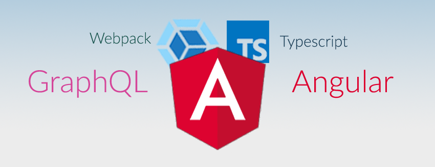

# Making Full Stack Applications With Angular & GraphQL
---
## We will go through each of these steps
*If you are reading this because you are stuck, skip to a more helpful section below...*

##### *[1. Starting Our Project](#starting-our-project)*
##### *[2. Setup Our Server](#setup-our-server)*
##### *[3. Connect to our database](#connect-to-our-database)*
##### *[4. Making a GraphQL schema](#making-a-graphql-schema)*
##### *[5. Setup Our Webpack Config]*
##### *[6. Add Angular Into Our Project]*
##### *[7. Create a Simple Client App]*
##### *[8. Summary]*

---

## Starting Our Project

To start off we will create our package.json with
```bash
npm init
```
After that, we need to install the dependencies for our server.
The fastest way is for you to just copy from this [package.json](http://google.com), and then run
```bash
npm install
(or yarn install)
```

We have our projects dependencies, now lets get into the meat of the app. We are gonna make a few folders and files.

```
/node_modules          - Where all of our dependencies live their life out
/src                   - The typescript source of our app
  /client              - We will put our angular code in here
  /server              - Our server declaration and backend config go here
    /schema            - We will define our Graphql Schema in this folder
    main.ts            - The main function for our server
    database.ts        - The code to connect to our database
    config.ts          - Variables related to configuration
```
Your app structure should look like the above.

---

##  Setup Our Server

Start by importing our dependencies into the main function

```
// src/server/main.ts

import * as express from 'express';
import * as bodyParser from 'body-parser';
import { graphqlExpress, graphiqlExpress } from 'graphql-server-express';
```

You might want to use hapi, restify, or something else. We are using express, but there is [graphQL support](https://github.com/apollographql/graphql-server) for all of these variants. graphiQl will let us test out our server and let us view our schema. Not essential, but helpful nonetheless.

Now lets setup the rest of our main. Read the comments for details.

```
// src/server/main.ts

export async function main(){
  // typical app instantiation
  let app = express();
  // We will import this function from src/server/database.ts in the next step
  let db = await connectDatabase();

  // This will create our graphql endpoint @ 'localhost:3000/graphql'
  // Later we will produce & import our schema to use here
  app.use('/graphql', bodyParser.json(), graphqlExpress({
    context: {
      db
    },
    schema: Schema
  }));

  // We also create the graphiql endpoint so that we can test our server out
  app.use('/graphiql', graphiqlExpress({endpointURL: '/graphql'}));

  // finally we return a promise to get our app running locally
  return new Promise((resolve, reject) => {
    let server = app.listen(3000, () => {
      resolve(server);
    }).on("error", (err: Error) => {
      reject(err);
    });
  });
}

main();

```
Note that we pass our soon to be connected database to the context object when we use the graphQL middleware. This is because data passed into the context can be accessed by our schema resolver functions.

##  Connect to our database

Lets write out a function for our app to connect to a database.
We will also take some variables from our main and aggregate them all to src/server/config.ts.

```
// src/server/database.ts

import { MongoClient } from 'mongodb';
import { DB_URL } from './config'

export async function connectDatabase(){
   try {
    let db = await MongoClient.connect(DB_URL);
    return db;
  }
  catch(err){
    console.log(err)
  }
}
```

A fairly simple function, but different databases will have different needs.

Our config file looks something like this now.
```
// src/server/config.ts

export const DB_URL = 'mongodb://localhost:27017/somedb';
export const SERVER_PORT = 3000;
export const GRAPHQL_ROUTE = "/graphql";
export const GRAPHIQL_ROUTE = "/graphiql";
```
The purpose of the config is to quickly find server variables. You can place more variables here as your backend develops, like CORS settings or ENV settings.

In the assets folder you will notice an animal data set in a few different formats. Insert this into your database to use with our project.

---

## Making a basic GraphQL schema

We will be creating a very modular schema, the folder structure will look like the below

```
// src/server/schema/
queries/         - Folder that we put our queries into
mutations/       - Folder that we put our mutations into
types/           - Folder that we put our types into
index.ts         - This code will wrap everything up and export the schema
```

Lets begin by creating a type definition for animals.


```
// types/animal.type.ts

export const typeDef = `
type Animal {
  name: String,
  hair: Boolean,
  feathers: Boolean,
  eggs: Boolean,
  milk: Boolean,
  airborne: Boolean,
  aquatic: Boolean,
  predator: Boolean,
  toothed: Boolean,
  backbone: Boolean,
  breathes: Boolean,
  venomous: Boolean,
  fins: Boolean,
  legs: String,
  tail: Boolean,
  domestic: Boolean
}
`;
```

If you are still learning graphQL, this [cheat sheet](https://wehavefaces.net/graphql-shorthand-notation-cheatsheet-17cd715861b6) will help out when making your own schema.

Next lets define some queries 

```
// queries/animal.query.ts

export const typeDef = `
# Root Query
type Query {
  getAllAnimals: [Animal]
  getFlyingAnimals: [Animal]
  getAnimalByName(name: String!): Animal
}
`;

export const resolver = {
  Query: {
    getAllAnimals(root, args, context) {
      return context.db.collection('animals').find().toArray();
    },
    getFlyingAnimals(root, args, context) {
      return context.db.collection('animals').find({airborne:true}).toArray();
    },
    getAnimalByName(root, args, context) {
      return context.db.collection('animals').findOne({name: args.name});
    },
  },
};
```

See how we used the `db` variable that we placed on the context in our `src/server/main.ts`. If you aren't using mongodb, your resolver functions will be different. You can even define them somewhere else, place them into the context, and then call them here.

 We can also add arguments to our queries and access them in the resovler function. By placing a `!` after the type in our typeDef, we can make this argument mandatory. 

 Lets add a simple mutation to our schema so we can wrap everything up.

 Our mutation will look like this.

(note that any time you are adding or changing data, defining a mutation is the appropriate way to do that)
 ```
 // mutaions/animal.mutaion.ts

export const typeDef = `
# Mutations
type Mutation {
    addAnimal(name: String!): Animal
}
`;

export const resolver = {
  Mutation: {
    addAnimal(root, args, context) {
      return context.db.collection('animals').insert(args);
    },
  },
};
```

This will look very similar to how our query looked, except instead of getting data from the database, we are adding data to the database.

Ideally we would create an [input type](http://graphql.org/graphql-js/mutations-and-input-types/) for our animal, but for right now we will stick with just adding the names of new animals.


Finally we will wrap every thing up into a graphql schema in our `src/server/schema/index.ts`.

In order for us to make the schema, we have to iterate though our modules and use a function called `makeExecutableSchema` from the graphql-tools library.

```
// index.ts

import { GraphQLSchema } from 'graphql';
import { makeExecutableSchema } from 'graphql-tools';
import * as mutations from './mutations/animal.mutation';
import * as queries from './queries/animal.query'; 
import * as types from './types/animal.type';

const typeDefs = [`
    schema {
        query: Query
        mutation: Mutation
    }
`,
  mutations.typeDef,
  queries.typeDef,
  types.typeDef
];

const resolvers = {...mutations.resolver, ...queries.resolver};

const Schema: GraphQLSchema = makeExecutableSchema({
  logger: console,
  resolvers: resolvers,
  typeDefs: typeDefs,
});

export {Schema};
```

The [`makeExecutableSchema` function](http://dev.apollodata.com/tools/graphql-tools/generate-schema.html#makeExecutableSchema) takes two arguments. First is our type definitions formatted as an array of strings, and the second is a resolver object that follows the [resolver pattern](http://dev.apollodata.com/tools/graphql-tools/resolvers.html).

You are almost ready to start playing around with the server side of our project.

All that's left is setting up our webpack config.